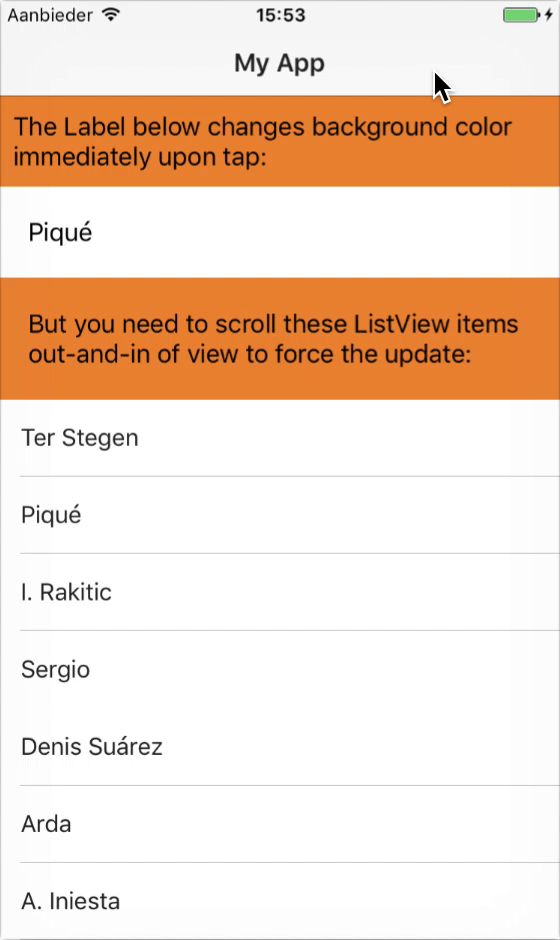
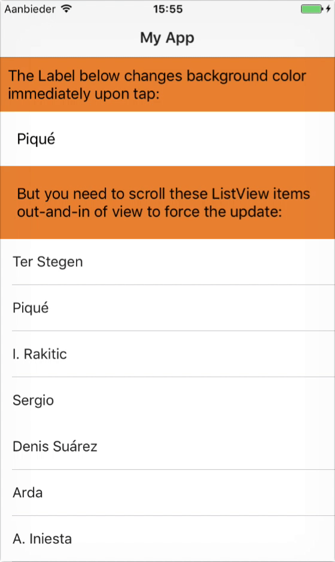

This repo reproduces [a NativeScript issue]() (GIF on the left) where you need to scroll a ListView item out of view (and back in) to see the updated background color.

The "fix" branch (GIF on the right) suggests a fix that works for me but may not be the best solution.

   
